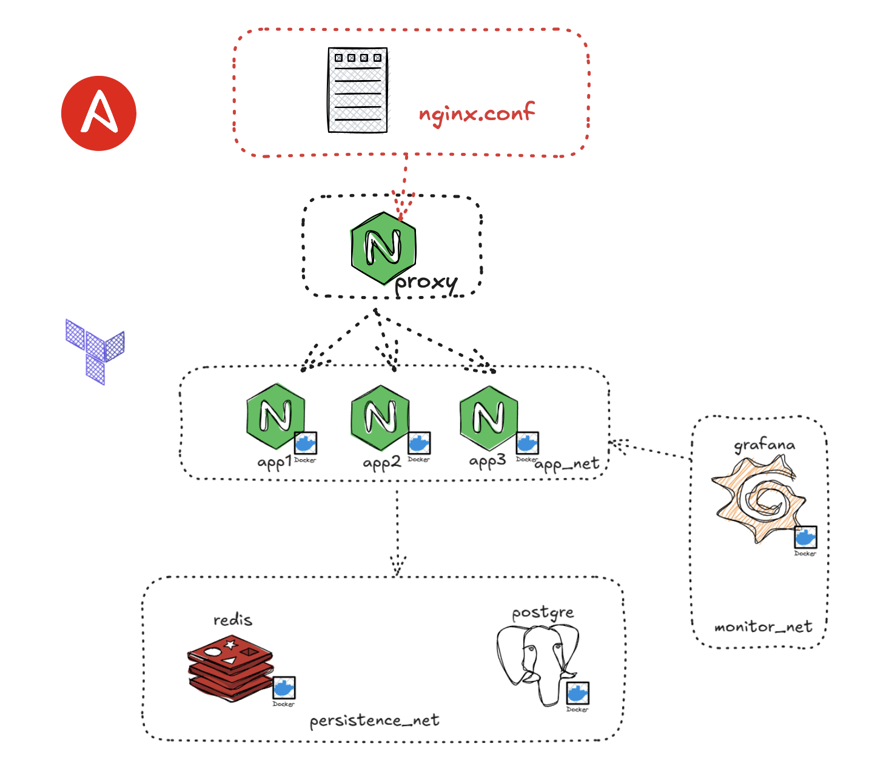

# Implementación de una arquitectura

Integrantes del grupo:
- Aguilar Chavez Fabricio (fabrilar1)
- Melendez Quezada Fabricio (FabricioMQ-sys)
- Muga Ponce Franco (redsquirrelx)
- Quispe Cesias Andro (AndroJQC)
- Rodriguez Acevedo Emerson (ron4ldo.Xrdz)

## Descripción
Este proyecto implementa una arquitectura pequeña utilizando:
- Terraform para la infraestructura
- Docker para la contenerización de los servicios
- Ansible para la configuración

Este se realiza en base al siguiente diagrama:



## Requisitos
- Terraform => v1.13.1
- Ansible => 2.18.9
- Docker => 28.4.0

## Uso

1. Clonar el repositorio:

```
git clone https://github.com/redsquirrelx/lab02-terraform
cd lab02-terraform
```

2. Crear la infraestructura con terraform:
```
sudo terraform -chdir=iac/ init
sudo terraform -chdir=iac/ workspace new dev
sudo terraform -chdir=iac/ workspace select dev
sudo terraform -chdir=iac/ apply
```

3. Luego, aplicar la configuración con ansible:
```
sudo ansible-playbook -i config/inventory.ini config/playbook.yaml
```

## Verificación

Acceder a los servicios:
```
localhost:89/web/
localhost:89/api/
```

o revisar los contenedores docker que están corriendo:
```
docker ps
```